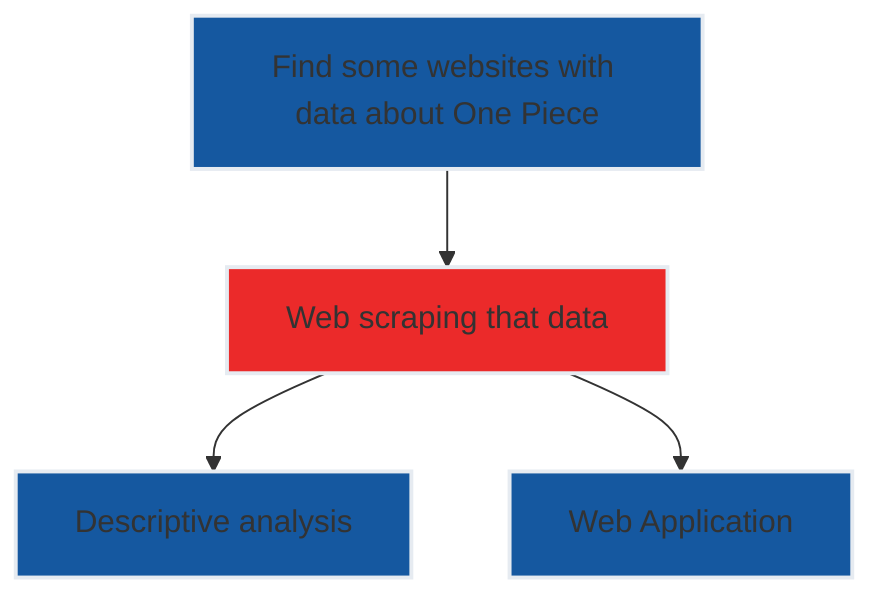

# One Piece - Stats
I was watching One Piece and out of nowhere I started watching an episode that looked like a filler, but the platform I was watching didn't say whether it was, then after that every time I had to look on weird websites to see if the episode was filler, so I decided to find data to create an application to provide such information.   
Basically the roadmap was

The beta of web application can be consulted [here](https://alissonrp.shinyapps.io/op_beta/?_ga=2.199898414.1077219620.1646952561-1144556888.1646851457) and the descriptive analysis [here](https://alissonrp.github.io/OP_Stats/) (at this moment in portuguese).

